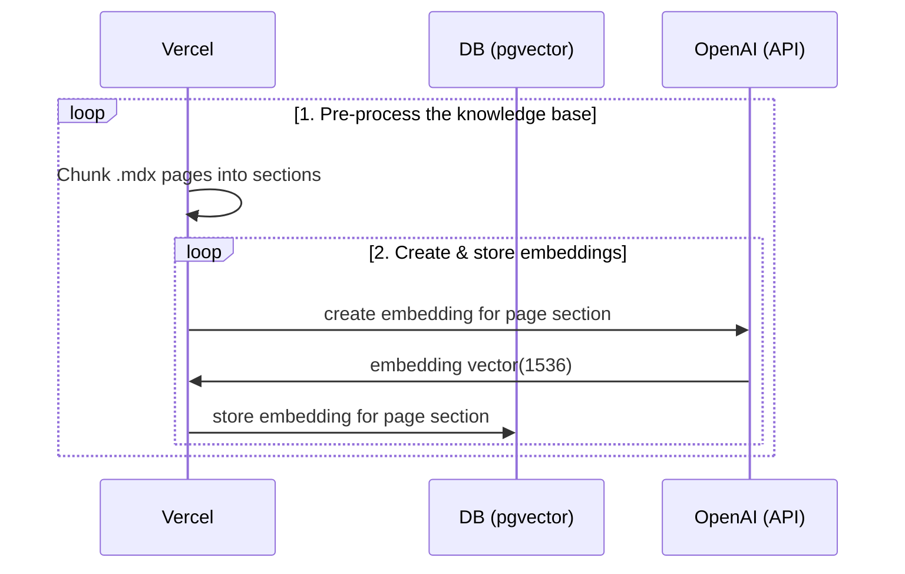
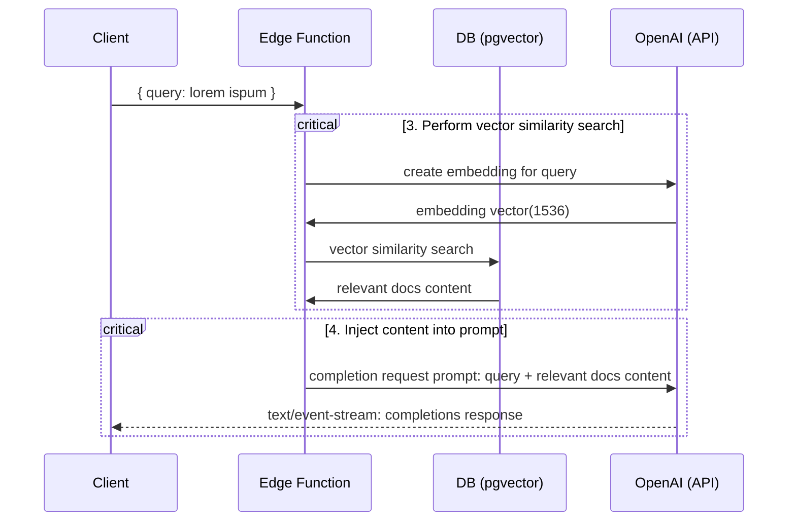

  <div class="image-container">
    <a href="https://github.com/pripramot/i-studio">
      <p></p>
    </a>
  </div>

  <h4 align="center">
    <a href="https://mtify.hashnode.dev/">Get Started</a> |
    <a href="https://github.com/ai-jiraphinya/ai-jiraphinya/wiki">Docs</a> |
    <a href="https://nuxt-movies.vercel.app">By TMDB</a>
  </h4>
  <h1 align="center">Document Search By Mint</h1>
</p>

<p align="center">
  <a aria-label="Join the community on Slack" href="https://mtify.hashnode.dev">
    
  <a aria-label="Join the on Telegram" href="https://ai-jiraphinya.github.io">
    
  </a>
  <a aria-label="Join the on Telegram" href="https://t.me/MintChatAI">
    
  </a>
  <a aria-label="Join the Mastodon" href="https://mastodon.social/@Mintify">
    
  </a>
</p>
    

<!--


https://mtify.hashnode.dev/
<p align="center">
   
</p>

<p align="center">
  <a href="https://mtify.hashnode.dev">
    
  </a>
-->
## Deploy
### Deploy Netlify No`OPENAI_KEY`No AI
[](https://app.netlify.com/sites/document-search/deploys)
</br>
### Deploy `OPENAI_KEY` Build MySQL:Supabase Docs
This starter takes all the `.mdx` files in the `pages` directory and processes them to use as custom context within [OpenAI Text Completion](https://platform.openai.com/docs/guides/completion) prompts.
Deploy this starter to Vercel. The Supabase integration will automatically set the required environment variables and configure your [Database Schema](./supabase/migrations/20230406025118_init.sql). All you have to do is set your `OPENAI_KEY` and you're ready to go!

[](https://vercel.com/new/clone?demo-title=Next.js%20OpenAI%20Doc%20Search%20Starter&demo-description=Template%20for%20building%20your%20own%20custom%20ChatGPT%20style%20doc%20search%20powered%20by%20Next.js%2C%20OpenAI%2C%20and%20Supabase.&demo-url=https%3A%2F%2Fsupabase.com%2Fdocs&demo-image=%2F%2Fimages.ctfassets.net%2Fe5382hct74si%2F1OntM6THNEUvlUsYy6Bjmf%2F475e39dbc84779538c8ed47c63a37e0e%2Fnextjs_openai_doc_search_og.png&project-name=Next.js%20OpenAI%20Doc%20Search%20Starter&repository-name=nextjs-openai-doc-search-starter&repository-url=https%3A%2F%2Fgithub.com%2Fsupabase-community%2Fnextjs-openai-doc-search%2F&from=github&integration-ids=oac_VqOgBHqhEoFTPzGkPd7L0iH6&env=OPENAI_KEY&envDescription=Get%20your%20OpenAI%20API%20key%3A&envLink=https%3A%2F%2Fplatform.openai.com%2Faccount%2Fapi-keys&teamCreateStatus=hidden&external-id=https%3A%2F%2Fgithub.com%2Fsupabase-community%2Fnextjs-openai-doc-search%2Ftree%2Fmain) 

## Technical Details

**Building your own custom ChatGPT involves four steps:**


1. [👷 Build time] Pre-process the knowledge base (your `.mdx` files in your `pages` folder).
2. [👷 Build time] Store embeddings in Postgres with [pgvector](https://supabase.com/docs/guides/database/extensions/pgvector).
3. [🏃 Runtime] Perform vector similarity search to find the content that's relevant to the question.
4. [🏃 Runtime] Inject content into OpenAI GPT-3 text completion prompt and stream response to the client.

## 👷 Build time

Step 1. and 2. happen at build time, e.g. when Vercel builds your Next.js app. During this time the [`generate-embeddings`](./lib/generate-embeddings.ts) script is being executed which performs the following tasks:



In addition to storing the embeddings, this script generates a checksum for each of your `.mdx` files and stores this in another database table to make sure the embeddings are only regenerated when the file has changed.

## 🏃 Runtime

Step 3. and 4. happen at runtime, anytime the user submits a question. When this happens, the following sequence of tasks is performed:



The relevant files for this are the [`SearchDialog` (Client)](./components/SearchDialog.tsx) component and the [`vector-search` (Edge Function)](./pages/api/vector-search.ts).

The initialization of the database, including the setup of the `pgvector` extension is stored in the [`supabase/migrations` folder](./supabase/migrations/) which is automatically applied to your local Postgres instance when running `supabase start`.

## Local Development

### Configuration

- `cp .env.example .env`
- Set your `OPENAI_KEY` in the newly created `.env` file.
- Set `NEXT_PUBLIC_SUPABASE_ANON_KEY` and `SUPABASE_SERVICE_ROLE_KEY` run:
  > Note: You have to run supabase to retrieve the keys.

### Start Supabase

Make sure you have Docker installed and running locally. Then run

```bash
supabase start
```

To retrieve `NEXT_PUBLIC_SUPABASE_ANON_KEY` and `SUPABASE_SERVICE_ROLE_KEY` run:

```bash
supabase status
```

### Start the Next.js App

In a new terminal window, run

```bash
pnpm dev
```

### Using your custom .mdx docs

1. By default your documentation will need to be in `.mdx` format. This can be done by renaming existing (or compatible) markdown `.md` file.
2. Run `pnpm run embeddings` to regenerate embeddings.
   > Note: Make sure supabase is running. To check, run `supabase status`. If is not running run `supabase start`.
3. Run `pnpm dev` again to refresh NextJS localhost:3000 rendered page.

## Learn More You need to find the video "Supabase" on YouTube.

I only **have** basic skills, so I might **not** be able to help you much.

- Example: Read the blogpost on how we built [ChatGPT for the Supabase Docs](https://supabase.com/blog/chatgpt-supabase-docs).
- [[Docs] pgvector: Example:Embeddings and vector similarity](https://supabase.com/docs/guides/database/extensions/pgvector)
- [video](https://youtu.be/Yhtjd7yGGGA) [Example:YouTube Channel](https://www.youtube.com/@RabbitHoleSyndrome):

[](https://www.youtube.com/watch?v=Yhtjd7yGGGA)

## Licence

Apache 2.0

<!--

This is a [Next.js](https://nextjs.org/) project bootstrapped with [`create-next-app`](https://github.com/vercel/next.js/tree/canary/packages/create-next-app).

## Getting Started

First, run the development server:

```bash
npm run dev
# or
yarn dev
# or
pnpm dev
```

Open [http://localhost:3000](http://localhost:3000) with your browser to see the result.

You can start editing the page by modifying `app/page.tsx`. The page auto-updates as you edit the file.

This project uses [`next/font`](https://nextjs.org/docs/basic-features/font-optimization) to automatically optimize and load Inter, a custom Google Font.

## Learn More

To learn more about Next.js, take a look at the following resources:

- [Next.js Documentation](https://nextjs.org/docs) - learn about Next.js features and API.
- [Learn Next.js](https://nextjs.org/learn) - an interactive Next.js tutorial.

You can check out [the Next.js GitHub repository](https://github.com/vercel/next.js/) - your feedback and contributions are welcome!

## Deploy on Vercel

The easiest way to deploy your Next.js app is to use the [Vercel Platform](https://vercel.com/new?utm_medium=default-template&filter=next.js&utm_source=create-next-app&utm_campaign=create-next-app-readme) from the creators of Next.js.

Check out our [Next.js deployment documentation](https://nextjs.org/docs/deployment) for more details.
<a rel="me" href="https://mastodon.social/@Jiraphinya">Mastodon</a>
-->
